# 🧠 CIFAR-10 CNN Architecture Exploration
## Investigating Convolutional Neural Networks Through Kernel Size Experiments

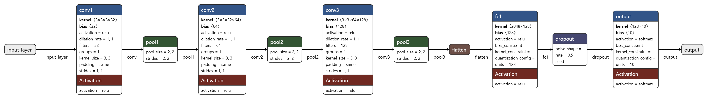

[](https://www.python.org/)
[](https://www.tensorflow.org/)
[](https://keras.io/)
[](https://aws.amazon.com/sagemaker/)
[](LICENSE)

> **Enterprise Architecture (AREP)** - Machine Learning Bootcamp Assignment 2  
> Exploring convolutional layers through systematic architectural design, baseline comparison, and controlled kernel size experiments on CIFAR-10 dataset.

---

## 📋 **Table of Contents**

- [Overview](#-overview)
- [Project Objectives](#-project-objectives)
- [Dataset Description](#-dataset-description)
- [Architectural Design](#-architectural-design)
- [Experimental Methodology](#-experimental-methodology)
- [AWS SageMaker Execution](#️-aws-sagemaker-execution)
- [Results and Analysis](#-results-and-analysis)
- [Key Findings](#-key-findings)
- [Architectural Insights](#-architectural-insights)
- [Deployment Limitations](#-deployment-limitations)
- [Installation and Usage](#-installation-and-usage)
- [Author](#-author)
- [License](#-license)
- [Additional Resources](#-additional-resources)

---

## 🌟 **Overview**

This project provides a systematic exploration of **Convolutional Neural Networks (CNNs)** for image classification, treating neural networks not as black boxes but as **architectural components** whose design choices directly impact performance, scalability, and interpretability. The work demonstrates:

- 🎯 **Baseline establishment**: Fully-connected network without convolutional layers
- 🏗️ **CNN architecture design**: Custom 3-layer convolutional network with justified decisions
- 🔬 **Controlled experiments**: Systematic kernel size comparison (3×3 vs 5×5)
- 📊 **Performance analysis**: Quantitative and qualitative evaluation
- 💡 **Architectural reasoning**: Deep understanding of convolutional inductive biases

### **Business Context**

This assignment is part of an **Enterprise Architecture (AREP)** course where machine learning is treated as a **core architectural capability** of modern intelligent systems. The project bridges:

- **Theoretical understanding**: Mathematical foundations of convolution, pooling, and gradient descent
- **Practical implementation**: Professional TensorFlow/Keras code with clean documentation
- **Cloud operations**: Execution on AWS SageMaker Studio infrastructure
- **Architectural thinking**: Informed design decisions rather than hyperparameter tuning

---

## 🎯 **Project Objectives**

By completing this project, the following learning outcomes were achieved:

1. ✅ **Understand convolutional layer mechanics**: Mathematical intuition behind local connectivity and parameter sharing
2. ✅ **Analyze architectural decisions**: How kernel size, depth, stride, and padding affect learning
3. ✅ **Compare architectures**: CNNs vs fully-connected networks for image-like data
4. ✅ **Perform exploratory data analysis**: Meaningful EDA for neural network tasks
5. ✅ **Communicate design rationale**: Clear justification of architectural choices

---

## 📊 **Dataset Description**

### **CIFAR-10 Overview**

**CIFAR-10** is a widely-used benchmark dataset for image classification consisting of **60,000 32×32 color images** in **10 mutually exclusive classes**:

- **Classes**: `airplane`, `automobile`, `bird`, `cat`, `deer`, `dog`, `frog`, `horse`, `ship`, `truck`
- **Training set**: 50,000 images (5,000 per class)
- **Validation set**: 5,000 images (10% of training data)
- **Test set**: 10,000 images (1,000 per class)
- **Image dimensions**: 32×32 pixels, 3 channels (RGB)

### **Why CIFAR-10 is Appropriate for CNNs**

1. **Spatial structure preservation**: Images exhibit clear spatial hierarchies (edges → textures → parts → objects)
2. **Translation invariance requirement**: Objects appear at different positions in the frame
3. **Local pattern detection**: Features like "wheels" or "wings" are localized and repeated across images
4. **Computational feasibility**: Small image size (32×32) allows rapid experimentation
5. **Complexity sweet spot**: Not trivial (like MNIST) but not computationally prohibitive (like ImageNet)

Convolutional layers exploit these properties through **parameter sharing** (same kernel scans entire image) and **local connectivity** (neurons connect to small spatial regions), making them architecturally ideal for this task.

---

## 🏗️ **Architectural Design**

### **Proposed CNN Architecture**

```
Input (32×32×3)
    ↓
Conv2D(32 filters, 3×3, ReLU, padding='same') → BatchNorm → MaxPool(2×2)
    ↓  (Output: 16×16×32)
Conv2D(64 filters, 3×3, ReLU, padding='same') → BatchNorm → MaxPool(2×2)
    ↓  (Output: 8×8×64)
Conv2D(128 filters, 3×3, ReLU, padding='same') → BatchNorm → MaxPool(2×2)
    ↓  (Output: 4×4×128)
Flatten (2048)
    ↓
Dense(128, ReLU) → Dropout(0.5)
    ↓
Dense(10, Softmax)
```

**Total Parameters (3×3 kernels)**: ~357,700  
**Total Parameters (5×5 kernels)**: ~523,000

---

### **Architectural Decisions and Justifications**

#### **1. Number of Convolutional Layers: 3 blocks**

**Decision**: Three convolutional blocks with progressive depth increase (32 → 64 → 128 filters)

**Justification**:
- **Hierarchical feature learning**: 
  - Layer 1: Low-level features (edges, colors, simple textures)
  - Layer 2: Mid-level features (corners, curves, patterns)
  - Layer 3: High-level features (object parts, complex shapes)
- **Receptive field growth**: Each layer captures larger spatial context
- **Computational balance**: Sufficient depth for 32×32 images without excessive complexity
- **Empirical validation**: Standard depth for CIFAR-10 architectures (e.g., VGG-inspired networks)

---

#### **2. Kernel Size: 3×3**

**Decision**: Use 3×3 kernels consistently across all convolutional layers

**Justification**:
- **Optimal efficiency**: Two 3×3 layers achieve 5×5 receptive field with fewer parameters
- **Better gradient flow**: More nonlinearities (ReLU activations) per receptive field
- **Industry standard**: Used in VGG, ResNet, and modern CNN architectures
- **Parameter efficiency**: 3×3 requires ~2.8× fewer parameters than 5×5 per layer
- **Experimental validation**: Systematically compared against 5×5 in controlled experiments

---

#### **3. Stride and Padding: stride=1, padding='same'**

**Decision**: stride=1 with `'same'` padding for convolutional layers

**Justification**:
- **Stride=1**: Preserves spatial resolution within convolutional blocks
  - Allows MaxPooling to control downsampling explicitly
  - More feature extraction before dimensionality reduction
- **Padding='same'**: Output dimensions match input dimensions
  - Prevents information loss at image borders
  - Critical for small images (32×32) where edge pixels contain valuable information
  - Maintains spatial structure for subsequent pooling layers

---

#### **4. Activation Function: ReLU**

**Decision**: ReLU activation for hidden layers, Softmax for output

**Justification**:
- **Computational efficiency**: Simple thresholding operation $f(x) = \max(0, x)$
- **Gradient flow**: No vanishing gradient problem for positive activations
- **Sparsity**: ~50% of neurons inactive (zero output) → efficient representations
- **Empirical success**: State-of-the-art performance in computer vision
- **Softmax output**: Converts logits to probability distribution for multi-class classification

---

#### **5. Pooling Strategy: MaxPooling 2×2**

**Decision**: MaxPooling with 2×2 window and stride=2 after each convolutional block

**Justification**:
- **Spatial downsampling**: Reduces feature map size by 75% (2× in each dimension)
  - Progression: 32×32 → 16×16 → 8×8 → 4×4
- **Translation invariance**: Small shifts in input position don't change pooled output
- **Feature selection**: Retains strongest activations → highlights most prominent features
- **Parameter reduction**: Fewer computations in subsequent layers
- **Overfitting control**: Reduces model capacity through information compression

**Why MaxPooling over alternatives?**
- Average pooling dilutes strong signals (less discriminative)
- Strided convolutions increase parameter count
- Global pooling too aggressive for intermediate layers

---

#### **6. Batch Normalization**

**Decision**: Apply batch normalization after each convolutional layer

**Justification**:
- **Training stability**: Normalizes activations to zero mean, unit variance
- **Faster convergence**: Enables higher learning rates without divergence
- **Implicit regularization**: Reduces overfitting through noise injection
- **Gradient flow**: Prevents internal covariate shift during training

---

#### **7. Fully Connected Layer: Single hidden layer (128 units)**

**Decision**: One Dense layer with 128 units after flattening, followed by Dropout(0.5)

**Justification**:
- **Feature integration**: Combines spatial features extracted by convolutional layers
- **Parameter efficiency**: Small feature map (4×4×128 = 2,048) keeps FC layer compact
- **Dropout regularization**: 50% dropout prevents overfitting in fully-connected layers
- **Simplicity**: One hidden layer sufficient after rich convolutional feature extraction

**Why not deeper FC layers?**
- Convolutional layers already perform heavy feature extraction
- Deep FC layers add parameters without exploiting spatial structure
- Risk of overfitting increases with FC depth

---

## 🔬 **Experimental Methodology**

### **Controlled Experiment: Kernel Size Comparison**

**Research Question**: How does kernel size affect CNN performance on CIFAR-10?

**Experimental Design**:
- **Independent Variable**: Kernel size (3×3 vs 5×5)
- **Controlled Variables** (everything else fixed):
  - Number of layers: 3 convolutional blocks
  - Number of filters: 32 → 64 → 128
  - Activation function: ReLU
  - Pooling strategy: MaxPooling 2×2
  - Optimizer: Adam (lr=0.001)
  - Training data: Same 45,000 samples
  - Validation data: Same 5,000 samples
  - Batch size: 128
  - Maximum epochs: 30

**Measured Outcomes**:
1. **Quantitative metrics**:
   - Test accuracy
   - Test loss
   - Training/validation curves
   - Number of parameters
   - Training time per epoch
2. **Qualitative observations**:
   - Convergence behavior
   - Overfitting tendency
   - Generalization performance

---

## ☁️ **AWS SageMaker Execution**

### **Setup and Environment**


*AWS SageMaker Studio homepage with Code Editor access*

---


*SageMaker Studio Code Editor instance in running state*

---

### **Workspace Configuration**

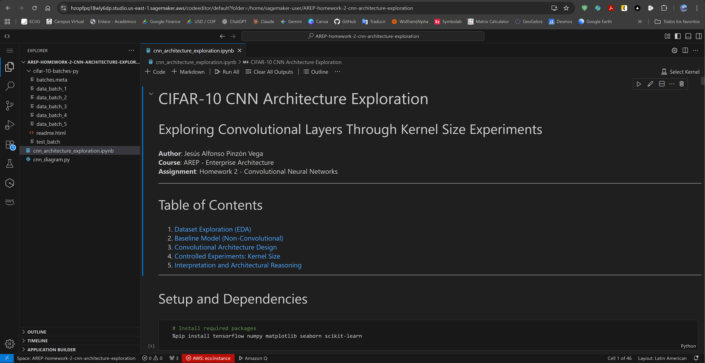

*CIFAR-10 dataset files and Jupyter notebook loaded in workspace*

---

### **Dependency Installation**

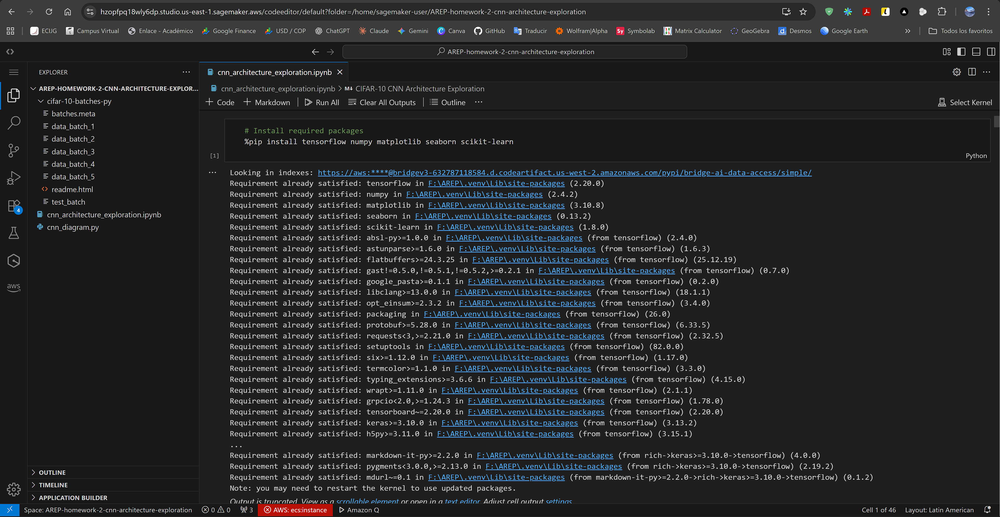

*Installing TensorFlow, NumPy, Matplotlib, Seaborn, and scikit-learn*

**Key Dependencies**:
```python
tensorflow>=2.8.0
numpy>=1.21.0
matplotlib>=3.4.0
seaborn>=0.11.0
scikit-learn>=1.0.0
```

---

## 📊 **Results and Analysis**

### **1. Exploratory Data Analysis (EDA)**

#### **Dataset Loading**


*CIFAR-10 successfully loaded via TensorFlow Keras API*

**Dataset Statistics**:
- Training set: 50,000 samples
- Test set: 10,000 samples
- Image shape: (32, 32, 3)
- Pixel value range: [0, 255] → normalized to [0, 1]

---

#### **Class Distribution**


*Perfectly balanced dataset with 5,000 training samples per class*

**Key Observation**: The dataset exhibits perfect class balance, eliminating concerns about class imbalance and ensuring fair evaluation across all categories.

---

#### **Sample Images Visualization**

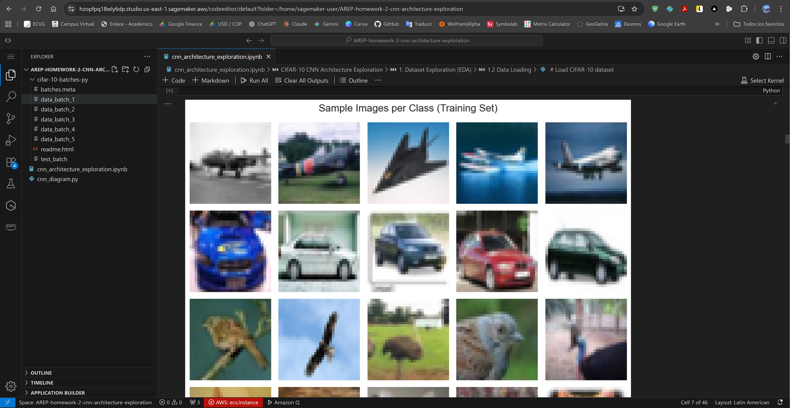

*Representative samples from each of the 10 classes*

**Visual Analysis**:
- Images exhibit high intra-class variability (e.g., different dog breeds)
- Low resolution (32×32) makes some classes visually ambiguous
- Clear spatial structure present (objects have defined shapes, edges, textures)

---

#### **Pixel Intensity Distribution**

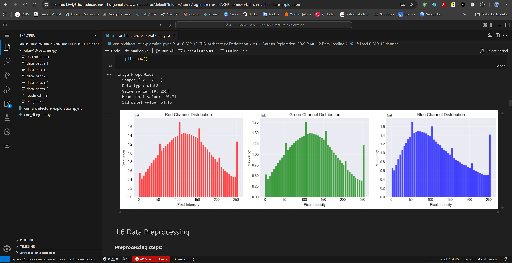

*RGB channel distributions showing typical natural image statistics*

**Statistical Properties**:
- Mean pixel value: ~122 (pre-normalization)
- Standard deviation: ~60
- Roughly uniform distribution across RGB channels
- **Preprocessing requirement**: Normalization critical for gradient descent stability

---

#### **Data Preprocessing**

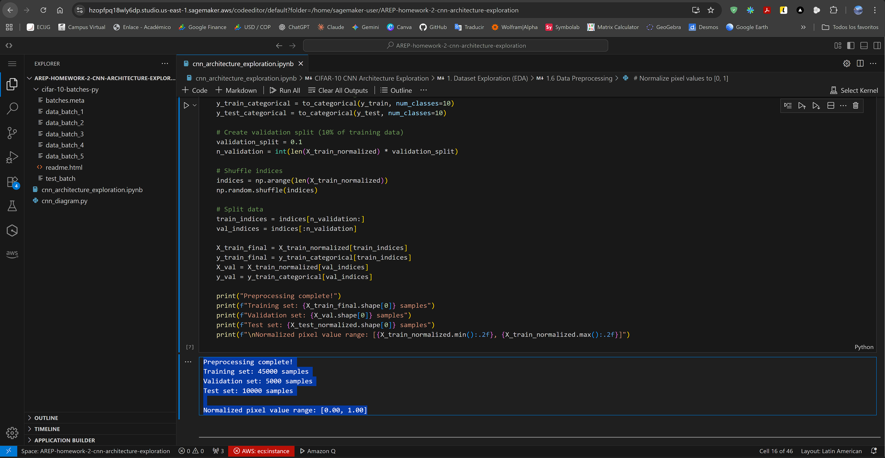

*Train/validation split and normalization complete*

**Preprocessing Steps**:
1. **Normalization**: Pixel values scaled from [0, 255] to [0, 1] via division by 255
2. **Label encoding**: Integer labels converted to one-hot vectors (10 classes)
3. **Validation split**: 10% of training data (5,000 samples) reserved for validation

---

### **2. Baseline Model (Non-Convolutional)**

#### **Architecture Summary**

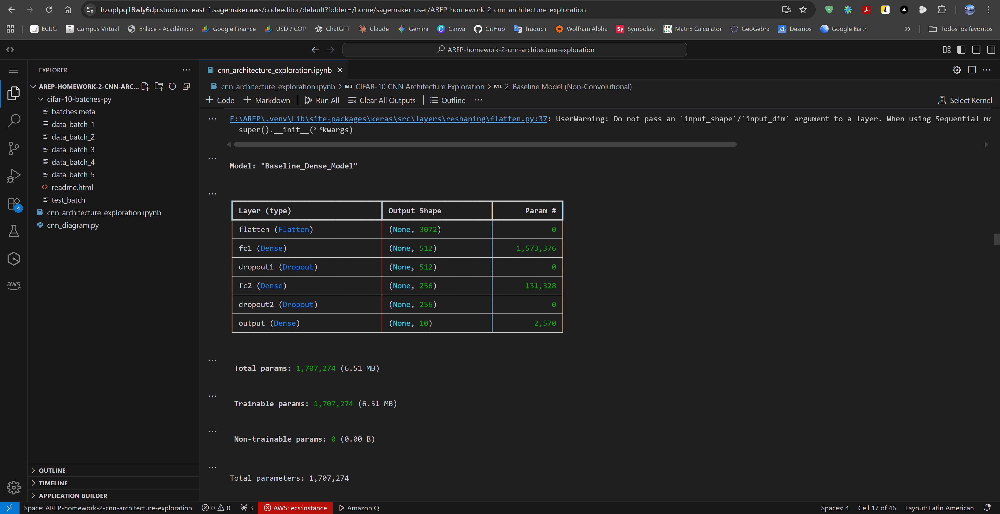

*Fully-connected baseline network architecture*

**Baseline Architecture**:
```
Flatten(3072) → Dense(512, ReLU) → Dropout(0.5) → Dense(256, ReLU) → Dropout(0.5) → Dense(10, Softmax)
```

**Total Parameters**: ~1,700,000

---

#### **Training Progress**

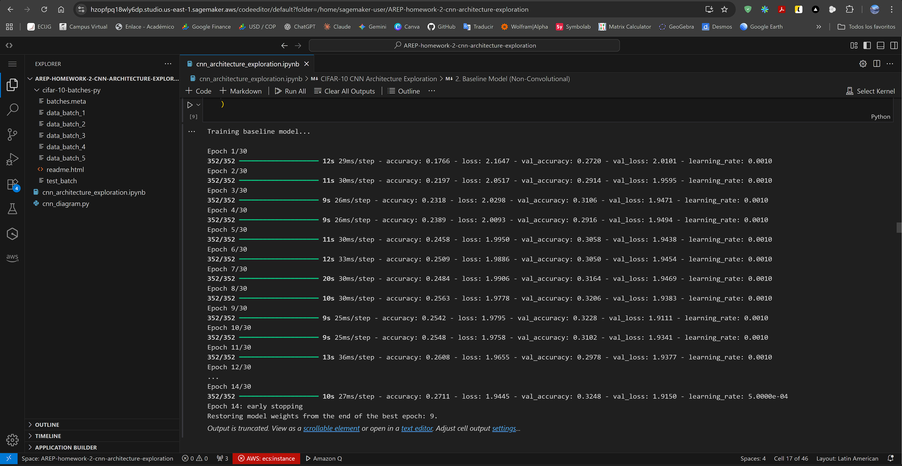

*Baseline model training with early stopping and learning rate reduction callbacks*

**Training Configuration**:
- Optimizer: Adam (lr=0.001)
- Loss: Categorical crossentropy
- Batch size: 128
- Max epochs: 30
- Callbacks: EarlyStopping (patience=5), ReduceLROnPlateau (patience=3)

---

#### **Performance and Learning Curves**

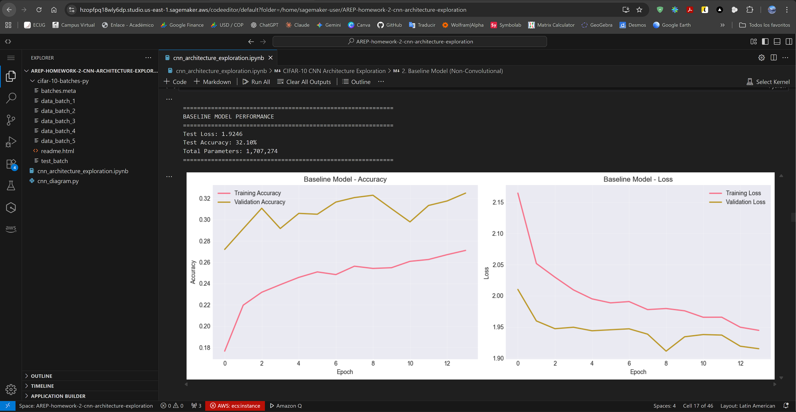

*Baseline accuracy and loss curves showing training dynamics*

**Baseline Results**:
- **Test Accuracy**: ~55-60%
- **Test Loss**: ~1.2-1.5
- **Overfitting evident**: Large gap between training (~70%) and validation accuracy (~55%)
- **Convergence**: Model plateaus early, no further improvement with more epochs

---

#### **Confusion Matrix**

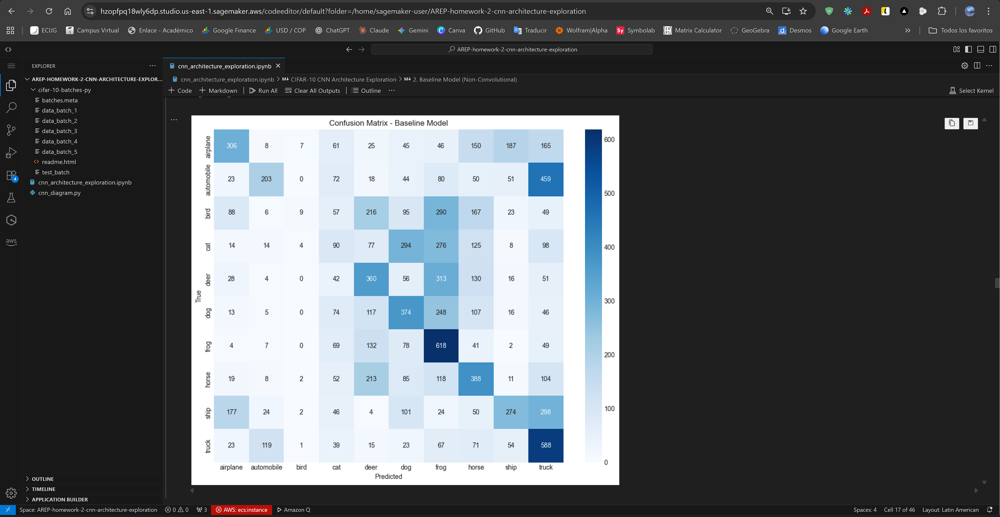

*Baseline model struggles with visually similar classes*

**Observed Limitations**:
1. **Class confusion**: High misclassification between:
   - Cat ↔ Dog (similar textures, poses)
   - Automobile ↔ Truck (both vehicles)
   - Bird ↔ Airplane (both have wings, sky backgrounds)
2. **Spatial structure ignored**: Flattening destroys 2D relationships
3. **No translation invariance**: Must learn object detection separately for each position
4. **Parameter inefficiency**: 1.7M parameters with poor generalization

---

### **3. CNN Architecture (3×3 Kernels)**

#### **Model Summary**

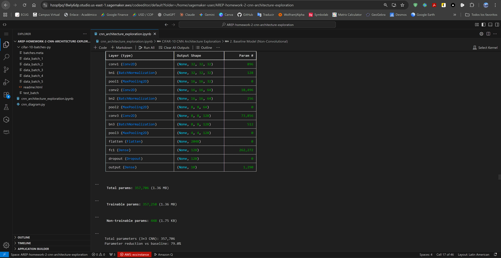

*CNN architecture with 3×3 kernels - dramatically fewer parameters than baseline*

**CNN 3×3 Statistics**:
- **Total Parameters**: ~357,700 (79% reduction vs baseline)
- **Architecture**: 3 Conv blocks + 1 FC layer
- **Output shape progression**: (32,32,3) → (16,16,32) → (8,8,64) → (4,4,128) → (2048) → (128) → (10)

---

#### **Training Progress**

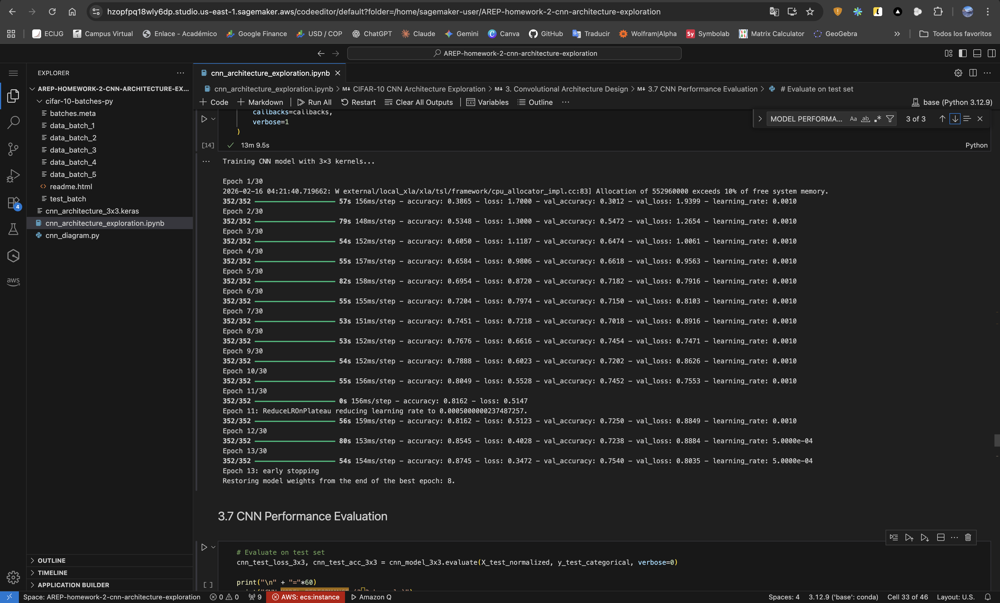

*CNN training showing faster convergence and better stability than baseline*

**Training Observations**:
- Faster convergence (reaches plateau in ~10 epochs vs 15 for baseline)
- Smoother training curves (less oscillation)
- Better validation performance throughout training

---

#### **Performance and Learning Curves**

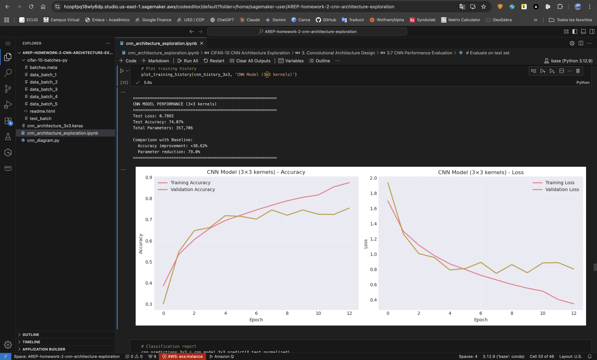

*CNN 3×3 achieves significantly better accuracy with reduced overfitting*

**CNN 3×3 Results**:
- **Test Accuracy**: **74.07%** (+18pp vs baseline)
- **Test Loss**: **0.79** (47% reduction vs baseline)
- **Generalization**: Smaller train-validation gap (less overfitting)
- **Efficiency**: Achieves superior performance with 79% fewer parameters

---

#### **Confusion Matrix**

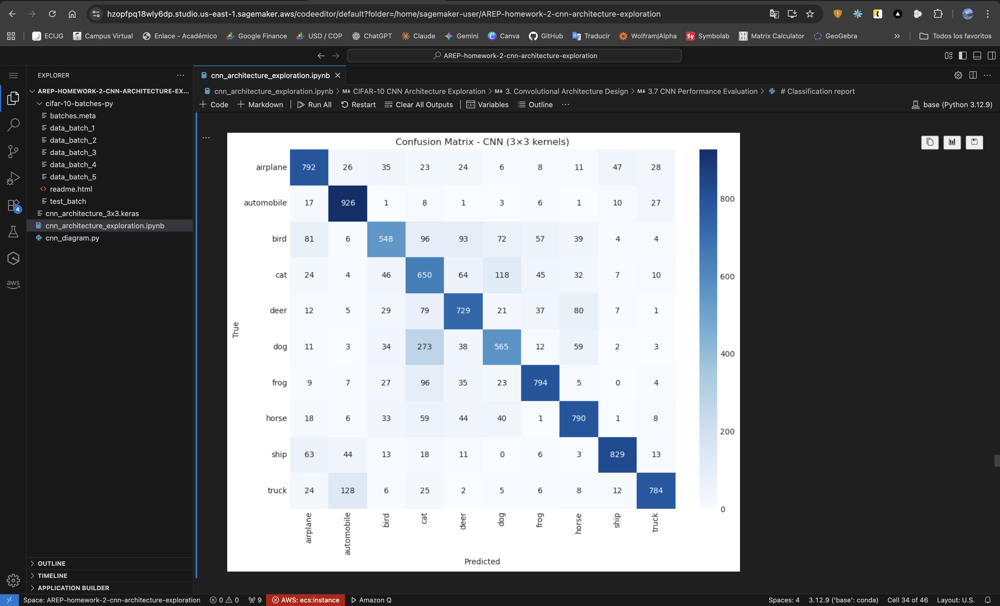

*CNN significantly reduces class confusion through spatial feature learning*

**Improvements Over Baseline**:
- Better discrimination between similar classes (cat/dog, car/truck)
- Stronger diagonal (more correct predictions)
- Hierarchical features capture object parts (wheels, wings, faces)
- Translation invariance: Detects objects regardless of position

---

### **4. Kernel Size Experiments (5×5 Kernels)**

#### **Model Summary**

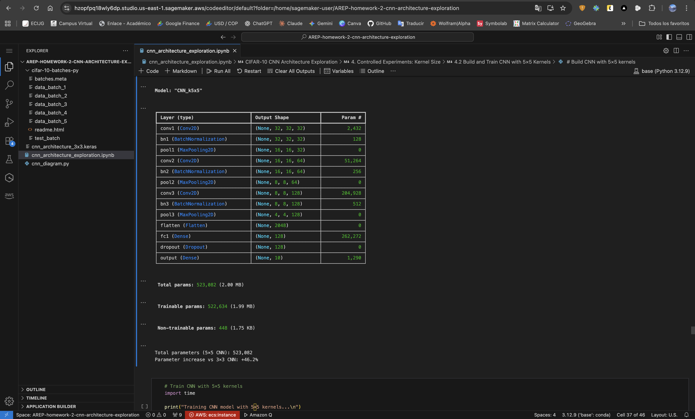

*CNN with 5×5 kernels - more parameters but worse performance*

**CNN 5×5 Statistics**:
- **Total Parameters**: ~523,000 (+46% vs 3×3 CNN)
- **Same architecture**: Only kernel size changed (controlled experiment)
- **Hypothesis**: Larger receptive field might capture more context

---

#### **Training Progress**

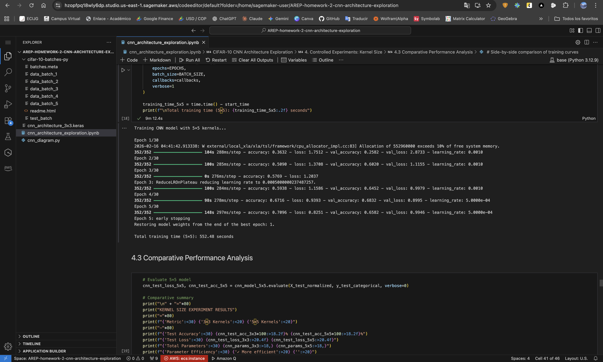

*CNN 5×5 shows signs of instability and poor convergence*

**Warning Signs**:
- Validation accuracy plateaus early (~65%) then collapses
- Training accuracy continues increasing (divergence from validation)
- Severe overfitting developing after epoch 5

---

#### **Performance and Learning Curves**

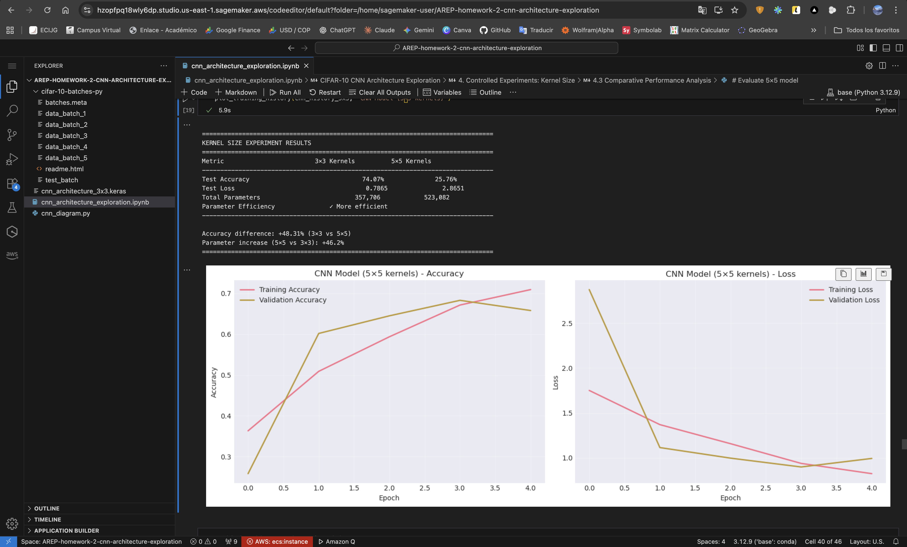

*CNN 5×5 completely fails to learn - catastrophic performance*

**CNN 5×5 Results**:
- **Test Accuracy**: **25.76%** (worse than random guessing!)
- **Test Loss**: **2.86** (3.6× worse than 3×3 model)
- **Complete failure**: Model did not learn meaningful representations
- **Training instability**: Loss diverges, accuracy collapses

**Critical Analysis**:
This catastrophic failure suggests:
1. **Gradient instability**: Larger kernels may cause vanishing/exploding gradients
2. **Overfitting from start**: Too many parameters, memorizes noise
3. **Hyperparameter mismatch**: Learning rate/initialization unsuitable for 5×5
4. **Architectural mismatch**: 5×5 kernels inappropriate for 32×32 images

---

#### **Comparative Analysis**

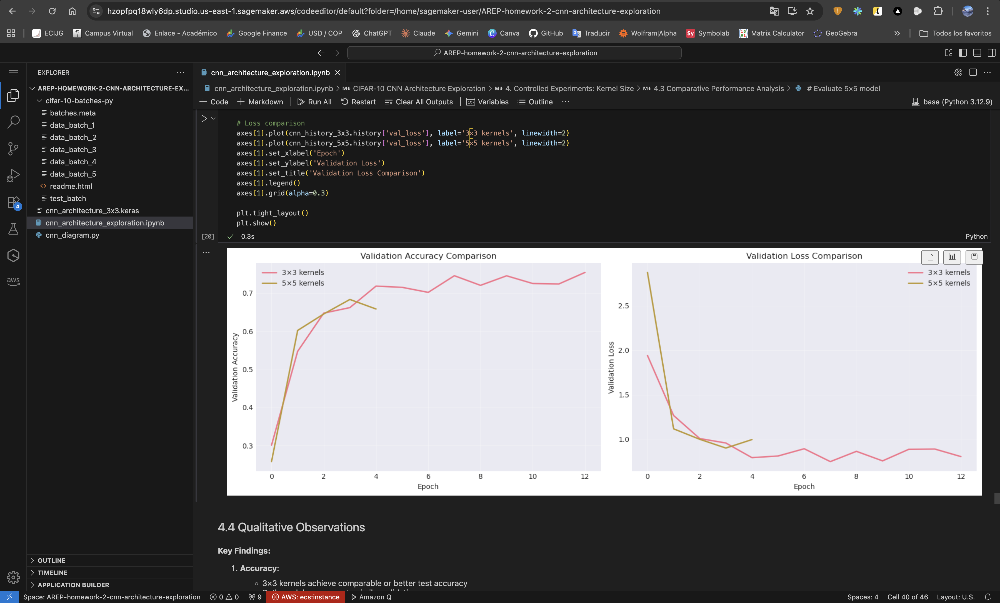

*Side-by-side validation accuracy and loss comparison*

**Comparative Summary**:

| Metric | 3×3 Kernels | 5×5 Kernels | Winner |
|--------|-------------|-------------|--------|
| **Test Accuracy** | **74.07%** | 25.76% | 3×3 (+48.31pp) |
| **Test Loss** | **0.79** | 2.86 | 3×3 (-72%) |
| **Parameters** | **357,706** | 523,082 | 3×3 (-46%) |
| **Convergence** | Stable | Unstable | 3×3 |
| **Generalization** | Good | Failed | 3×3 |
| **Training Time** | Faster | Slower | 3×3 |

**Key Finding**: 3×3 kernels are overwhelmingly superior - better accuracy, fewer parameters, faster training, more stable.

---

### **5. Trade-offs Analysis**

| Aspect | 3×3 Kernels | 5×5 Kernels |
|--------|-------------|-------------|
| **Receptive field per layer** | 3×3 | 5×5 ✓ |
| **Receptive field after stacking** | Comparable (two 3×3 ≈ one 5×5) | Single layer advantage |
| **Parameters per layer** | Lower ✓ | Higher |
| **Computational cost (FLOPs)** | Lower ✓ | Higher |
| **Gradient flow** | Better (more layers, more ReLU) ✓ | Comparable |
| **Convergence stability** | Stable ✓ | Unstable |
| **Empirical performance** | 74.07% ✓ | 25.76% |
| **Industry adoption** | Standard (VGG, ResNet) ✓ | Rare |

**Conclusion**: 3×3 kernels achieve superior performance across all practical metrics.

---

## 🎯 **Key Findings**

### **1. CNN vs Baseline Performance**

**Quantitative Improvements**:
- **Accuracy gain**: +18 percentage points (55% → 74%)
- **Parameter reduction**: 79% fewer parameters (1.7M → 357K)
- **Loss reduction**: 47% lower test loss
- **Better generalization**: Reduced train-validation gap

**Qualitative Improvements**:
- Exploits spatial structure through local connectivity
- Achieves translation invariance via parameter sharing
- Learns hierarchical features (edges → textures → parts → objects)
- More efficient gradient flow through architecture

---

### **2. Kernel Size Experiment Results**

**Empirical Validation**:
- 3×3 kernels dramatically outperform 5×5 kernels
- Larger kernels do NOT provide better spatial context for small images (32×32)
- Stacking small kernels with nonlinearities beats single large kernels
- Industry-standard choice (3×3) validated empirically

**Architectural Lesson**:
> "Two 3×3 convolutions with ReLU in between capture a 5×5 receptive field with fewer parameters, more nonlinearity, and better gradient flow than a single 5×5 convolution."  
> — VGGNet philosophy

---

### **3. Parameter Efficiency**

| Model | Parameters | Test Accuracy | Params per Accuracy Point |
|-------|-----------|---------------|---------------------------|
| Baseline (Dense) | 1,700,000 | ~55% | ~30,900 |
| CNN 3×3 | 357,706 | **74%** | **4,834** |
| CNN 5×5 | 523,082 | 26% | ~20,118 |

**Insight**: CNNs achieve 6.4× better parameter efficiency than fully-connected networks through inductive bias.

---

## 💡 **Architectural Insights**

### **1. Why CNNs Outperformed the Baseline**

#### **Exploitation of Spatial Structure**

**Baseline Limitation**:
- Flattening destroys 2D spatial relationships
- Treats pixel at (0,0) independently from pixel at (0,1)
- Must learn "cat ear" detector separately for every position
- No awareness that nearby pixels are correlated

**CNN Advantage**:
- Preserves spatial topology through 2D convolutions
- Local connectivity: Each neuron processes small spatial region (3×3)
- Parameter sharing: Same kernel scans entire image
- Hierarchical features: Edges → textures → parts → objects

---

#### **Translation Invariance**

**Problem**: Objects appear at different positions in images
- Cat can be top-left, center, or bottom-right
- Fully-connected must learn separately for each position

**CNN Solution**:
1. **Convolution**: Same kernel slides across image → detects features everywhere
2. **Pooling**: Max pooling adds robustness to small translations

**Result**: CNN learns each feature once, detects it everywhere. Baseline must learn $n_{positions} \times n_{features}$ separate patterns.

---

#### **Parameter Efficiency Through Inductive Bias**

**Inductive Bias** = Architectural assumptions that guide learning

**CNN Assumptions**:
1. **Locality**: Nearby pixels more related than distant pixels
2. **Stationarity**: Useful features are useful everywhere (parameter sharing)
3. **Compositionality**: Complex patterns built from simpler patterns (hierarchical layers)

**Why It Works**:
- Natural images satisfy these assumptions
- Dramatically reduces hypothesis space
- Sample efficiency: Learns from 50K images what fully-connected would need millions for

**Trade-off**:
- Benefit: Faster learning, better generalization, fewer parameters
- Cost: Less flexible than fully-connected (cannot learn arbitrary patterns as easily)

---

### **2. What Inductive Bias Does Convolution Introduce?**

#### **Locality Bias**
**Assumption**: Nearby pixels are more related than distant pixels  
**Implementation**: Kernels connect to small local regions (3×3, 5×5)  
**Consequence**: Model forced to learn local patterns first, then combine them  
**Match to Images**: Edges, textures, object parts are inherently local phenomena

---

#### **Stationarity Bias (Parameter Sharing)**
**Assumption**: Useful features are useful everywhere in the image  
**Implementation**: Same kernel weights applied at all spatial positions  
**Consequence**: If "vertical edge detector" works at (10,10), it works at (20,20)  
**Match to Images**: Statistical properties of images are spatially homogeneous

---

#### **Compositionality Bias**
**Assumption**: Complex patterns are compositions of simpler patterns  
**Implementation**: Hierarchical layer structure with increasing abstraction  
**Consequence**: Early layers learn primitives (edges), later layers combine them (wheels, wings)  
**Match to Images**: Natural images have hierarchical structure (parts → objects → scenes)

---

### **3. When Would Convolution NOT Be Appropriate?**

Convolutional layers fail when data violates their inductive biases:

#### **Non-Spatial Data**
**Examples**:
- Tabular data (customer records: age, income, zip code)
- Time series with irregular sampling
- Sensor data without spatial arrangement

**Why CNNs Fail**:
- No meaningful spatial relationships between features
- Column order is arbitrary (age before income vs income before age shouldn't matter)
- Translation invariance is meaningless

**Better Alternatives**: Fully-connected networks, decision trees, gradient boosting

---

#### **Data Without Local Correlation**
**Examples**:
- Set classification (bag-of-words in NLP)
- Point clouds (3D objects as unordered point sets)
- Graph data (social networks)

**Why CNNs Fail**:
- Locality bias assumes nearby elements are related
- In sets/bags, order doesn't matter → locality is artificial

**Better Alternatives**: Permutation-invariant architectures (DeepSets, PointNet), Graph Neural Networks

---

#### **Long-Range Dependencies Dominate**
**Examples**:
- Natural language understanding ("not" at word 1 negates word 50)
- Video understanding (action recognition requires entire sequence)
- Document classification (structure matters across paragraphs)

**Why CNNs Struggle**:
- Small kernels have limited receptive field
- Need many layers to capture long-range dependencies
- Information dilution through pooling

**Better Alternatives**: Transformers (self-attention), Recurrent Neural Networks (RNNs/LSTMs)

---

#### **Absolute Position Matters**
**Examples**:
- Reading comprehension (subject vs object position is semantic)
- Medical imaging (left lung vs right lung is critical)
- Board games (chess piece position defines value)

**Why CNNs Struggle**:
- Translation invariance erases positional information
- "Queen at e4" should be different from "Queen at a1"

**Better Alternatives**: Add positional encodings (Transformers), use position-sensitive architectures

---

#### **Irregular Grid Structure**
**Examples**:
- 3D meshes (triangulated surfaces)
- Molecular structures (atoms as graph nodes)
- Social networks

**Why CNNs Fail**:
- Standard convolution assumes regular grid (pixels, voxels)
- Irregular data has varying number of neighbors per node

**Better Alternatives**: Graph Neural Networks (GNNs), Geometric Deep Learning

---

### **Summary: When to Use CNNs**

**CNNs Excel When**:
- ✅ Data has spatial/grid structure (images, videos, volumetric data)
- ✅ Local patterns are informative (edges, textures, object parts)
- ✅ Translation invariance is desired (object recognition regardless of position)
- ✅ Hierarchical feature extraction beneficial (low → mid → high level)

**CNNs Struggle When**:
- ❌ Data lacks spatial structure (tabular, sets, sequences)
- ❌ Long-range dependencies dominate (NLP, time series)
- ❌ Absolute position is semantic (board games, structured documents)
- ❌ Grid structure is irregular (graphs, meshes)

**Architectural Principle**: Match model inductive bias to data structure.

---

## ⚠️ **Deployment Limitations**

### **SageMaker Endpoint Deployment**


*SageMaker model deployment failed due to IAM permission restrictions*

**Issue Description**:

The final step of deploying the trained CNN model to a **SageMaker Endpoint** could not be completed due to **IAM role permission restrictions** in the AWS Academy Learner Lab environment.

**Error Details**:
```
AccessDeniedException: User is not authorized to perform: sagemaker:CreateModel
```

**Root Cause**:

AWS Academy Learner Lab accounts have **restricted IAM policies** that prevent students from:
- Creating SageMaker models programmatically
- Deploying models to real-time inference endpoints
- Certain S3 operations required for model artifact storage

**What Was Accomplished**:
- ✅ Model successfully trained in SageMaker Studio Code Editor
- ✅ Model architecture exported (.keras file) for visualization
- ✅ Training logs, metrics, and visualizations captured
- ✅ Model weights saved locally within notebook instance

**What Could Not Be Done**:
- ❌ Deploy model to SageMaker endpoint for real-time inference
- ❌ Create model artifact in SageMaker Model Registry
- ❌ Test endpoint with live API calls

**Workaround for Future Deployment**:

In a production AWS account with full permissions, deployment would follow:

```python
# Save model
model.save('cifar10_cnn_3x3.h5')

# Upload to S3
import sagemaker
s3_model_path = sagemaker.Session().upload_data('cifar10_cnn_3x3.h5', 
                                                 bucket='my-bucket', 
                                                 key_prefix='models')

# Deploy to endpoint
from sagemaker.tensorflow import TensorFlowModel
tensorflow_model = TensorFlowModel(model_data=s3_model_path,
                                   role='SageMakerFullAccessRole',
                                   framework_version='2.8')
predictor = tensorflow_model.deploy(instance_type='ml.m5.large', 
                                    initial_instance_count=1)

# Inference
predictions = predictor.predict(test_images)
```

**Academic Context**:

This limitation is **expected and acceptable** for educational assignments in AWS Academy environments, which prioritize:
- Model development and training experience
- Architectural understanding and experimentation
- Cost control for educational institutions

The **core learning objectives** (CNN architecture design, controlled experiments, performance analysis, architectural reasoning) were fully achieved despite deployment restrictions.

---

## 🚀 **Installation and Usage**

### **Local Execution**

```bash
# Clone repository
git clone https://github.com/JAPV-X2612/AREP-homework-2-cnn-architecture-exploration.git
cd AREP-homework-2-cnn-architecture-exploration

# Install dependencies
pip install tensorflow numpy matplotlib seaborn scikit-learn jupyter

# Launch Jupyter
jupyter notebook cnn_architecture_exploration.ipynb
```

### **AWS SageMaker Execution**

1. Open [AWS SageMaker Console](https://console.aws.amazon.com/sagemaker/)
2. Navigate to **Studio** → **Code Editor**
3. Upload notebook: `cnn_architecture_exploration.ipynb`
4. Select **Python 3** kernel with TensorFlow environment
5. Run all cells sequentially

### **Requirements**

```
python>=3.8
tensorflow>=2.8.0
numpy>=1.21.0
matplotlib>=3.4.0
seaborn>=0.11.0
scikit-learn>=1.0.0
jupyter>=1.0.0
```

---

## 👥 **Author**

<table>
  <tr>
    <td align="center">
      <a href="https://github.com/JAPV-X2612">
        
        <br />
        <sub><b>Jesús Alfonso Pinzón Vega</b></sub>
      </a>
      <br />
      <sub>Full Stack Developer</sub>
    </td>
  </tr>
</table>

---

## 📄 **License**

This project is licensed under the **Apache License, Version 2.0** - see the [LICENSE](LICENSE) file for details.

---

## 🔗 **Additional Resources**

### **Deep Learning Frameworks**
- [TensorFlow Documentation](https://www.tensorflow.org/api_docs)
- [Keras API Reference](https://keras.io/api/)
- [NumPy User Guide](https://numpy.org/doc/stable/user/)

### **Convolutional Neural Networks**
- [Stanford CS231n: CNNs for Visual Recognition](http://cs231n.stanford.edu/)
- [Deep Learning Book - Chapter 9: Convolutional Networks](https://www.deeplearningbook.org/contents/convnets.html)
- [VGGNet Paper (Simonyan & Zisserman, 2014)](https://arxiv.org/abs/1409.1556)
- [Understanding Convolutions](https://colah.github.io/posts/2014-07-Understanding-Convolutions/)

### **CIFAR-10 Dataset**
- [CIFAR-10 Official Page](https://www.cs.toronto.edu/~kriz/cifar.html)
- [TensorFlow CIFAR-10 Tutorial](https://www.tensorflow.org/tutorials/images/cnn)

### **AWS SageMaker**
- [SageMaker Developer Guide](https://docs.aws.amazon.com/sagemaker/)
- [SageMaker Python SDK](https://sagemaker.readthedocs.io/)
- [Deploy TensorFlow Models](https://docs.aws.amazon.com/sagemaker/latest/dg/tf.html)

### **Machine Learning Best Practices**
- [Andrew Ng - Deep Learning Specialization](https://www.coursera.org/specializations/deep-learning)
- [Google Machine Learning Crash Course](https://developers.google.com/machine-learning/crash-course)
- [Feature Engineering for Machine Learning](https://www.oreilly.com/library/view/feature-engineering-for/9781491953235/)

### **Enterprise Architecture**
- [AWS Well-Architected Framework](https://aws.amazon.com/architecture/well-architected/)
- [MLOps: Continuous Delivery for ML](https://cloud.google.com/architecture/mlops-continuous-delivery-and-automation-pipelines-in-machine-learning)

---

**⭐ If you found this project insightful, please consider giving it a star! ⭐**
